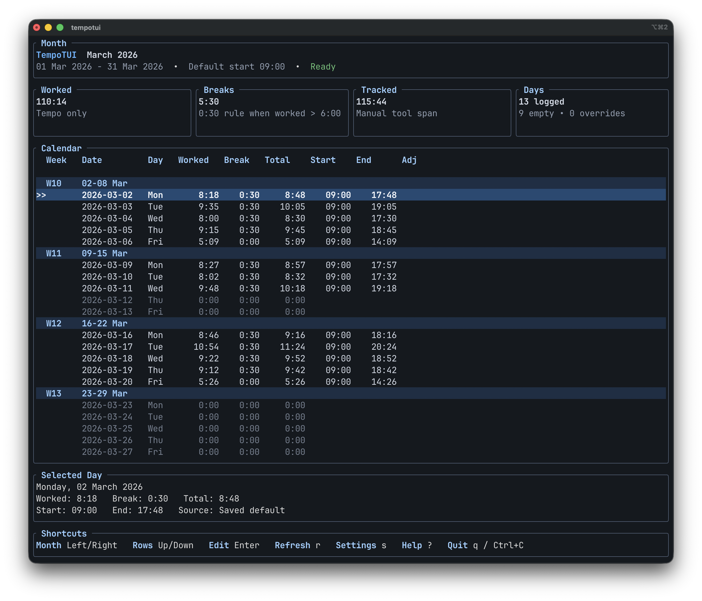

# tempotui

`tempotui` is a terminal UI for visualizing your Tempo time tracking per month.

It allows you to:
- configure automated (statutory) breaks
- adjust the start time of a working day



## Requirements

- A Tempo API token for the right Tempo region.
- Jira site URL, email, and Atlassian API token for account discovery.

## Install

### Homebrew

```bash
brew tap robaerd/tap
brew install --cask tempotui
```

### Binary download

Download the macOS or Linux archive from [GitHub Releases](https://github.com/robaerd/tempotui/releases).

### From source

```bash
cargo install --git https://github.com/robaerd/tempotui
```

## Run From Source

```bash
cargo run
```

## Configuration

On macOS and Linux, the app stores its config at:

- `$XDG_CONFIG_HOME/tempotui/config.toml`
- or `~/.config/tempotui/config.toml` when `XDG_CONFIG_HOME` is unset

## Troubleshooting

- If the saved credentials fail verification at startup, tempotui sends you back to Connection Setup instead of opening with bad settings.
- A `401` from Tempo usually means your token belongs to a different Tempo region than the base URL you configured.
- Jira is only used to look up your Atlassian `accountId`. After that, tempotui loads your month from Tempo using the saved Tempo token and that account ID.
